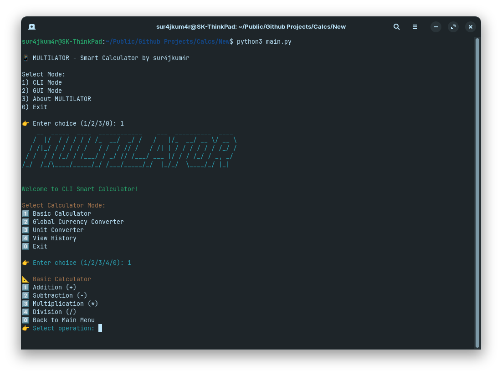
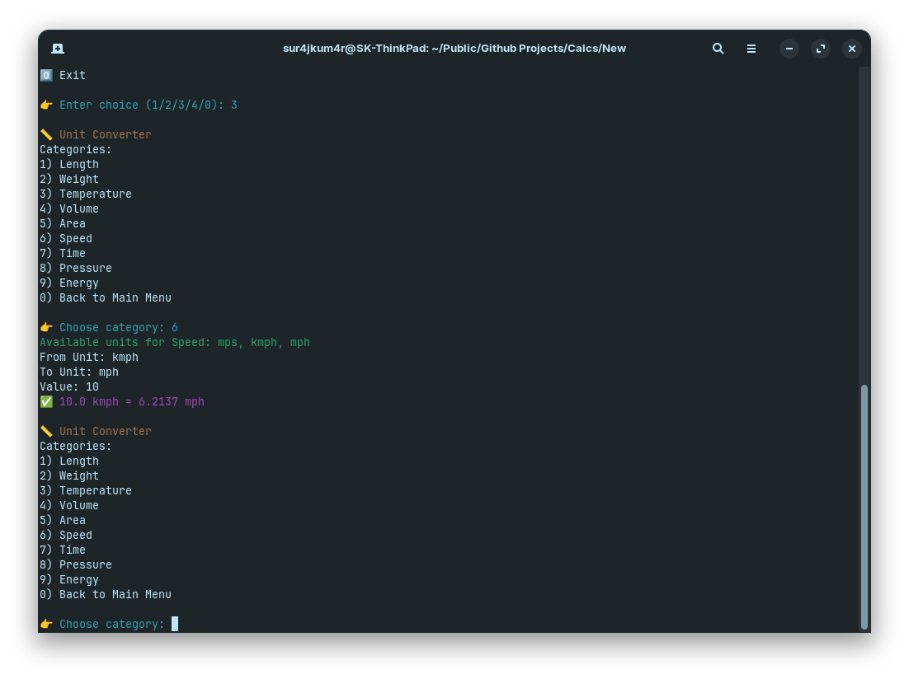
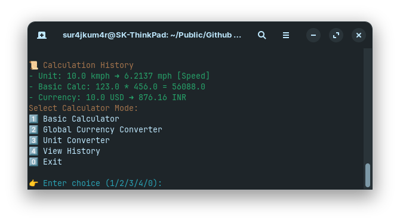

# 📱 MULTILATOR - Smart Calculator by sur4jkum4r

A modern, multi-functional smart calculator built with **PySide6**. It supports:

- 🔢 Basic Arithmetic Calculations  
- 💱 AIO Currency Conversion (real-time via API)  
- 📏 AIO Unit Conversion (Length, Weight, Temperature..etc)  
- 🕘 History Tracking for previous calculations  

---

## 📂 Folder Structure

Multilator/
├── main.py
├── gui_mode_pyside.py
├── cli_mode.py
├── currency_api.py
├── requirements.txt
├── screenshots/
│   ├── basic.png
│   ├── currency.png
│   ├── unit.png
│   └── history.png
└── README.md

---

## 📸 Screenshots

| Basic Calculator | Currency Converter | Unit Converter | History Panel |
|------------------|--------------------|----------------|----------------|
|  |  |  |  |

---

## 🚀 Installation

Make sure you have **Python 3.7+** installed.

1. Clone this repo:
   git clone https://github.com/sur4jkum4r/Multilator.git
   cd Multilator
  
2. Install dependencies:

pip install -r requirements.txt

---

## 🛠 Requirements

All required packages are listed in requirements.txt, including:

PySide6

Requests

---

## 🧠 Usage

Run the main launcher to choose between CLI and GUI mode:

python main.py

You will see:

📱 Smart Calculator - sur4jkum4r

Select Mode:
1) CLI Mode
2) GUI Mode
3) About MULTILATOR
0) Exit

👉 Enter choice (1/2/3/0):

Choose 1 for terminal-based CLI Calculator

Choose 2 for interactive GUI built with PySide6

Choose 3 for about the programe

Choose 0 to exit the program

---

## 🔁 Switching Between Modes

From the main menu (main.py), you can easily switch between CLI Mode and GUI Mode.

Within the GUI app, switch between Basic, Currency, Unit, and History using the top navigation bar.

---

## 💱 Currency Exchange API

Currency conversion is powered by the API in currency_api.py. Ensure your internet is active to fetch live exchange rates.

---

## 🧾 History

Last 10 calculations from any mode (Basic, Currency, Unit) are stored in memory and can be viewed in the History tab in GUI.

---

## 👤 About

Tool Name: Multilator

Created by: Suraj Prajapati 

Contact: sur4jkum4r.org@gmail.com

Location: Ahmedabad, India

---

## ⚖️ License

This project is licensed under the Apache License 2.0 - see the LICENSE file for details.

---

## ⭐ Keep Supporting

If you like AnyGet, give it a ⭐ star, share it with your friends & contribute improvements! 
